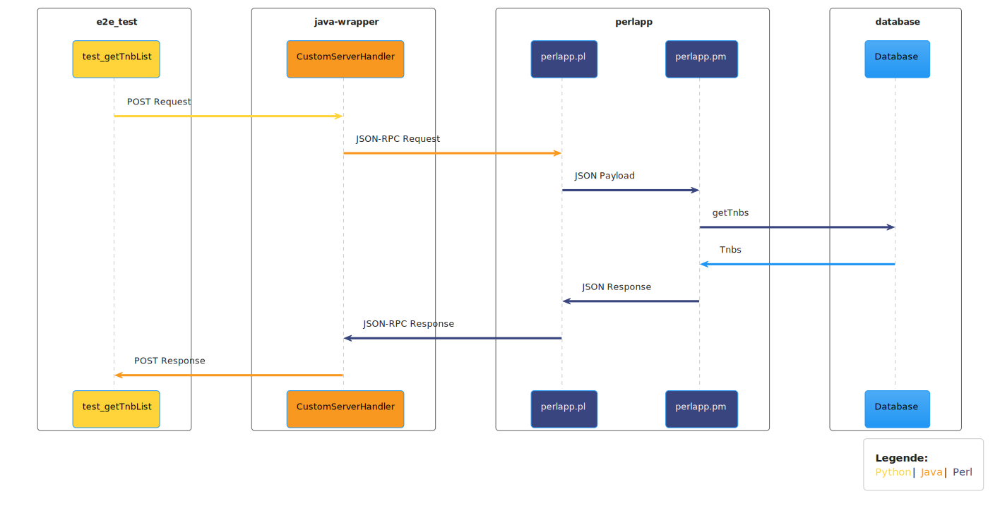
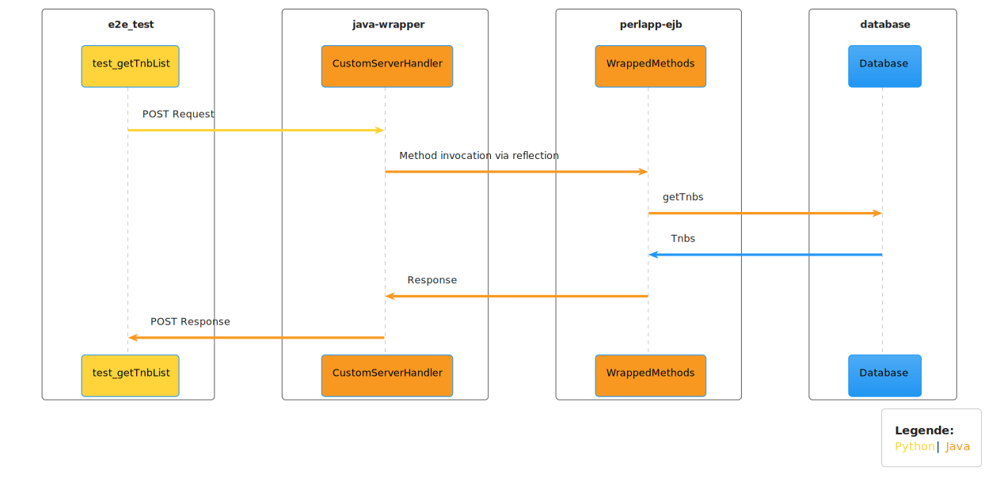

# Perl-to-Java Translation Project

## Projektinformationen

Diese Applikation ist eine minimalistische Version eines Produktivsystems. Sie dient als Grundlage für eine Übersetzung von Perl zu Java. Die Hauptaufgabe dieses Projekts besteht darin, zu vergleichen, wie gut Menschen im Vergleich zu Large Language Models (LLMs) eine Methode aus Perl nach Java übersetzen können.

## Voraussetzungen

Stelle sicher, dass du die folgenden Tools installiert hast:

- Docker
- Java 21
- Maven 3.6.1
- Python 3.10

## Systemvoraussetzungen

**Wichtig**: Diese Applikation wird ausschließlich auf UNIX-basierten Systemen (Linux und Mac) unterstützt. Es gibt **keine Unterstützung für Windows**. Falls du auf Windows arbeitest, kannst du ein Tool wie [WSL (Windows Subsystem for Linux)](https://docs.microsoft.com/de-de/windows/wsl/) verwenden, um eine Linux-Umgebung bereitzustellen.

## Projektstruktur

- **Perl Anwendung**: Der Kern der Applikation befindet sich im `perlapp`-Ordner. Die Hauptlogik liegt in der Datei `Perlapp.pm`.
- **Java Wrapper**: Eine Java-Anwendung wrappt die Perl-Anwendung. Alle Requests an das System werden zuerst an die Java-Applikation geschickt. Wenn die gewünschte Methode in Java existiert, wird sie dort verarbeitet. Andernfalls wird der Request an die Perl-Applikation weitergeleitet.

<details>
<summary>Ablauf der Request-Verarbeitung</summary>

Die folgenden Diagramme veranschaulichen den Ablauf der Request-Verarbeitung innerhalb der Applikation:

- **Request-Handling-Perl**: Dieses Sequenzdiagramm zeigt den Ablauf eines Requests, wenn er von der Perl-Applikation verarbeitet wird.
- **Request-Handling-Java**: Dieses Sequenzdiagramm zeigt den Ablauf eines Requests, wenn er von der Java-Applikation verarbeitet wird.
- **Request Routing**: Dieses Aktivitätsdiagramm beschreibt die Entscheidungslogik, wann der Java- und wann der Perl-Pfad für die Verarbeitung eines Requests verwendet wird.

### Request-Handling-Perl


### Request-Handling-Java


### Request Routing


</details>

## Aufgabe

1. **Zeit**: Bitte nimm ca. eine Stunde Zeit, um die Methode `getTnbList` aus der Datei `Perlapp.pm` nach Java zu übersetzen.
2. **Speicherort**: Die übersetzte Methode soll sich im Modul `perlapp-ejb` befinden. Erstelle eine Methode in `WrappedMethods`, die die Funktionalität der Perl-Methode `getTnbList` repliziert.
3. **Abgabe**: Forke bitte das Repository, arbeite an der Übersetzung, und sende mir den Link zu deiner Abgabe. Solltest du wesentlich länger als 60 Minuten benötigen, kannst du auch den aktuellen Stand pushen. Auch unvollständige oder nicht funktionierende Lösungen werden ausgewertet.

**Wichtig:** Bei der Aufgabe geht es primär um eine **Übersetzung des Codes** und nicht um eine Verbesserung. Verbesserungen sind nicht Bestandteil der Analyse und können in einem späteren Schritt erfolgen. Da Perl und Java sich jedoch in ihren Sprach-Features stark unterscheiden, sind 1:1 Übersetzungen oft nicht möglich. Du kannst also den aus deiner Sicht besten Weg wählen, um die Funktionalität in Java nachzubilden.

**:warning: Bitte fertige die Übersetzung ohne die Hilfe von LLMs oder anderen KI-basierten Hilfsmitteln an und sieh dir vor deiner Abgabe keine Lösungen anderer Teilnehmer an. :warning:**

## Entwicklung

### Anwendung starten
Im Root-Verzeichnis kannst du die Applikation mit folgendem Befehl starten:
   ```bash
   docker compose up --build --remove-orphans
   ```
**Hinweis:** Beim ersten Ausführen dieses Befehls kann es etwas länger dauern, da alle Abhängigkeiten heruntergeladen und die Container erstellt werden müssen. Bei mir hat der Vorgang beim ersten Mal etwa 160 Sekunden gedauert. Es ist also normal, wenn es bei dir auch in diesem Zeitrahmen liegt.

### Python Umgebung einrichten (für Tests)
1. Wechsel in das Verzeichnis `e2e_tests`
2. Erstelle eine virtuelle Umgebung mit den folgenden Befehlen:
```bash 
python3 -m venv ./venv
source ./venv/bin/activate
pip install -r requirements.txt 
```
3. Führe die Test aus mit:
```bash
python -m unittest
```
Alternativ kannst du auch PyCharm verwenden, um eine virtuelle Umgebung zu erstellen, die Abhängigkeiten zu installieren und die Tests direkt auszuführen.

#### Hinweis
Nach jeder Änderung am Code musst du den Docker-Container neu starten, bevor du die Tests erneut ausführen kannst.

**Wichtig:** Nach dem Hochfahren der Anwendung und dem Ausführen der Tests sollten alle Tests grün sein. Nachdem du die Methode getTnbList von Perl nach Java übersetzt hast, sollten ebenfalls alle Tests wieder grün sein. Achte also darauf, dass deine Übersetzung keine Tests bricht.

### Fragen?
Falls Fragen aufkommen, zögere nicht, mich zu kontaktieren.